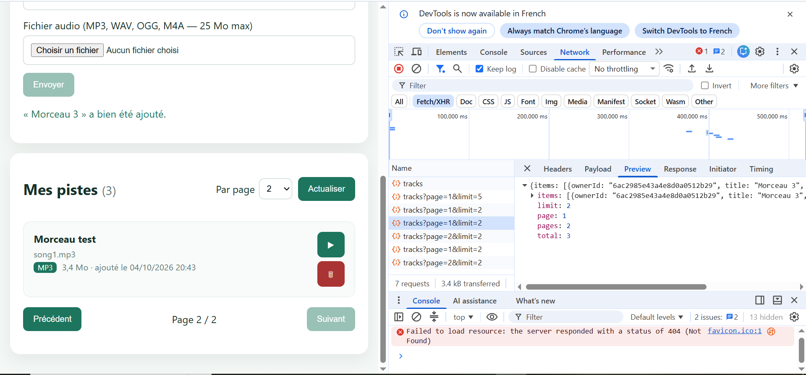
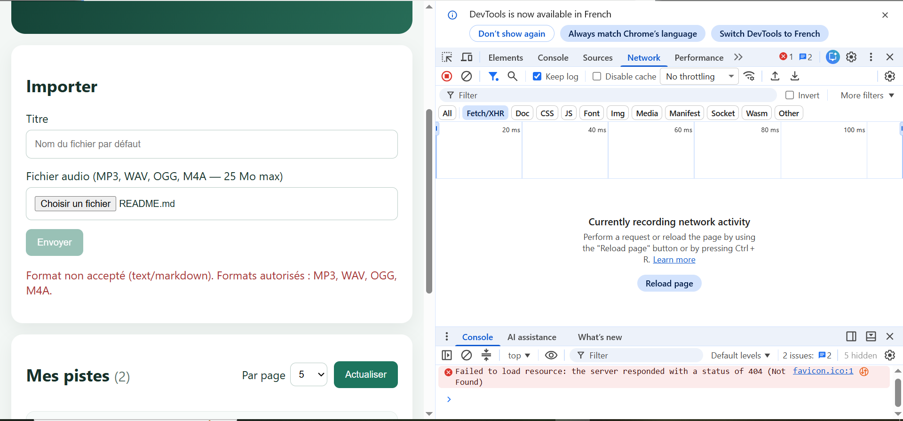
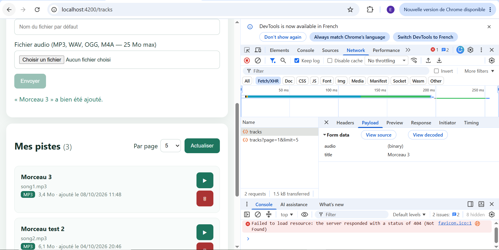
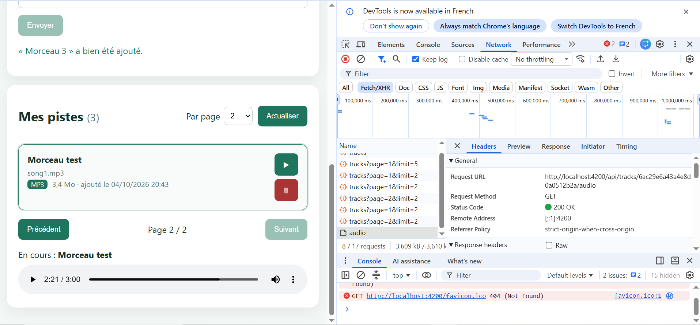
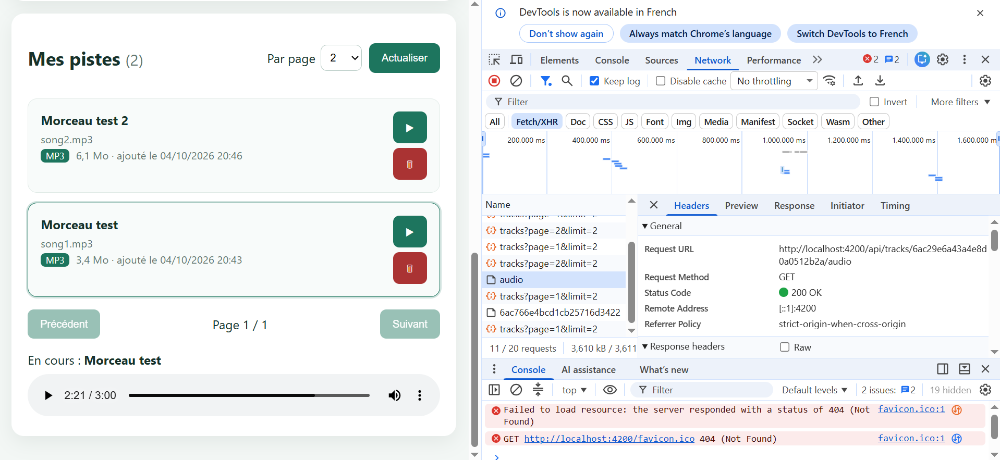

# Rapport d'usage de l'IA - TP1

Étudiante : Emili MERAHI

## Outil utilisé

- Assistant : Claude (Anthropic), utilisé comme guide pas à pas : il expliquait chaque étape et fournissait le code, que j'ai moi-même collé dans les fichiers, enregistré et testé dans le navigateur.
- Modèle : Claude Opus
- Consommation de tokens : non affichée dans l'interface utilisée.

## Préparation

- **Objectif** : configurer MongoDB Atlas, le fichier `backend/.env`, lancer le backend et le frontend.
- **Ce que j'ai fait** : réutilisation de mon cluster Atlas existant, réinitialisation du mot de passe de l'utilisateur de base, accès réseau `0.0.0.0/0`, construction de l'URI avec le nom de base `guitar-practice-cloud`.
- **Problèmes rencontrés** :
  - PowerShell bloquait `npm` (politique d'exécution des scripts) → passage au terminal Git Bash.
  - Dans `.env`, la clé `MONGODB_URI=` était écrite deux fois → corrigé.
  - La touche F12 éteint mon PC → ouverture des DevTools par clic droit → « Inspecter ».
- **Vérifications** : `GET /api/health` → `{"status":"ok"}` ; terminal backend : « Connecté à MongoDB Atlas » et « Compte de démonstration créé » ; upload et lecture de `song1.mp3` et `song2.mp3`.
- **Point de vigilance** : j'ai transmis par erreur le mot de passe de la base à l'assistant ; je dois le changer dans Atlas (Database Access → Edit Password) et mettre à jour `.env`.

## Mission 0 — Cartographie

- **Objectif** : repérer composant racine, routes, HttpClient, modèles/services/pages, intercepteur JWT.
- **Prompt principal** : « aide-moi à faire le TP1 étape par étape ».
- **Plan proposé par l'agent** : lire `main.ts`, puis `routes.ts`, puis `shared/` (services, intercepteur, guard), puis écrire la cartographie et le schéma du flux de connexion.
- **Vérifications** : j'ai ouvert chaque fichier cité ; j'ai testé la redirection d'une adresse inconnue vers `/tracks` (route `**`).
- **Résultat** : voir [TP1_REPONSES.md](TP1_REPONSES.md).

## Mission 1 — Inscription, connexion et profil

- **Objectif** : formulaires réactifs validés, appels register/login, stockage du JWT, Signal `currentUser`, redirections, déconnexion, profil, gestion du 401.
- **Plan proposé par l'agent** (une étape = un fichier, testée avant de passer à la suivante) :
  1. `shared/utils/http-error-message.ts` (nouveau) : transformer une erreur HTTP en message lisible.
  2. `AuthService` : ajout de `isAuthenticated` (`computed`) et redirection vers `/login` dans `logout()`.
  3. Page connexion : validations, messages d'erreur, bouton désactivé pendant l'envoi.
  4. En-tête (`app`) : nom de l'utilisateur + bouton « Se déconnecter », menu selon l'état connecté, profil rechargé après F5.
  5. Page inscription : validations alignées sur le backend (nom ≥ 2, email, mot de passe ≥ 8).
  6. Page profil : chargement automatique de `/api/users/me`, modification du nom, message de succès.
  7. `authInterceptor` : en cas de 401 sur une route protégée → déconnexion + `/login`.
- **Propositions écartées / points de vigilance** :
  - Le starter pré-remplissait `demo@example.com` / `Demo1234!` dans le code du formulaire : retiré (pas de mot de passe dans le code Angular).
  - Rediriger vers `/login` sur tous les 401 aurait empêché d'afficher « Identifiants incorrects » : exception pour `/api/auth/*`.
  - Les captures Network ne montrent ni le mot de passe (onglet Payload) ni le token (onglet Response du login, en-tête Authorization coupé).
- **Fichiers modifiés** (backend non modifié) :
  - `frontend-starter/src/app/shared/utils/http-error-message.ts` (nouveau)
  - `frontend-starter/src/app/shared/services/auth.service.ts`
  - `frontend-starter/src/app/shared/interceptors/auth.interceptor.ts`
  - `frontend-starter/src/app/components/app/app.ts` et `app.html`
  - `frontend-starter/src/app/components/login-page/login-page.ts` et `.html`
  - `frontend-starter/src/app/components/register-page/register-page.ts` et `.html`
  - `frontend-starter/src/app/components/profile-page/profile-page.ts` et `.html`
- **Tests réalisés** :
  - Connexion : champs vides → messages ; mauvais mot de passe → « Identifiants incorrects » (401) ; bon mot de passe → `/tracks`.
  - Déconnexion → `/login`, token supprimé du localStorage.
  - Inscription : mot de passe trop court → message ; `demo@example.com` → « Email déjà utilisé » (409) ; nouveau compte → `/profile`.
  - Profil : nom chargé automatiquement ; modification → « Nom mis à jour. » et nom changé dans l'en-tête.
  - Token remplacé par `abc` dans le localStorage + F5 → retour automatique sur `/login`.
- **Preuves** :
  - 
  - 
  - 
  - 
- **Ce que je sais maintenant expliquer sans l'agent** :
  - le trajet d'une requête de connexion : composant → service → HttpClient → intercepteur → proxy → Express → MongoDB ;
  - le rôle de l'intercepteur (ajout du `Bearer` et gestion du 401) et du guard (protection des routes) ;
  - pourquoi `tap()` dans le service : mémoriser token et utilisateur sans bloquer la réponse ;
  - la différence entre Signal (réactif, en mémoire) et localStorage (persistant, non réactif) ;
  - pourquoi le composant ne fait jamais d'appel HTTP directement.

---

# Rapport d'usage de l'IA - TP2

## Préparation

- **Objectif** : relancer backend et frontend.
- **Problème rencontré** : PowerShell bloquait encore `npm` → réglé définitivement avec `Set-ExecutionPolicy -Scope CurrentUser RemoteSigned`.
- **Vérification** : « Connecté à MongoDB Atlas », connexion avec le compte démo, page Backing tracks affichée.

## Mission 2 — Bibliothèque paginée

- **Objectif** : pagination côté serveur avec `GET /api/tracks?page=…&limit=…`, état en Signals, `@for` / `@empty` / `@if`, boutons Précédent / Suivant désactivés aux bornes.
- **Prompt principal** : « On commence le TP2, étape par étape. » — avec comme contexte fourni à l'agent : le projet complet (archive du dépôt), le sujet `SUJET_ETUDIANT_TP2.md`, `API_CONTRACT.md` et les consignes `AGENTS.md` / `best-practices.md`. Consigne donnée : avancer une étape à la fois, m'expliquer chaque fichier avant que je le modifie, et ne pas toucher au backend.
- **Plan proposé par l'agent** : vérifier que `TrackService.list(page, limit)` transmet bien `page` et `limit`, puis ajouter dans le composant les Signals `tracks`, `page`, `pages`, `total`, `limit`, `loading`, `error`, une nouvelle requête à chaque changement de page et un choix « par page » (2 / 5 / 10) pour tester la pagination avec peu de pistes.
- **Vérifications** : avec « 2 par page » et 3 pistes → « Page 1 / 2 » puis « Page 2 / 2 » ; dans Network, `tracks?page=1&limit=2` puis `tracks?page=2&limit=2` ; Précédent grisé en page 1, Suivant grisé en dernière page.
- **Proposition écartée** : récupérer toutes les pistes puis les découper dans Angular (interdit par le sujet). Les options avancées (Angular Material Paginator, plugin `aggregate-paginate-v2`) n'ont pas été réalisées.
- **Fichiers modifiés** : `shared/services/track.service.ts`, `components/tracks-page/tracks-page.ts` et `.html`.
- **Preuve** : 

## Mission 3 — Upload et lecture audio

- **Objectif** : analyser le flux existant, valider le fichier côté front, gérer l'état pendant l'envoi, cards accessibles, lecteur avec morceau en cours, erreur audio et révocation de l'ObjectURL.
- **Prompt principal** : suite de la même conversation (« étape suivante ») ; l'agent s'appuyait sur la Mission 3 du sujet. Mes demandes de précision pendant le travail : où trouver les éléments dans la page, que mettre dans les captures sans montrer le token, comment prouver la suppression.
- **Plan proposé par l'agent** :
  1. `track.service.ts` : commentaires sur `FormData` (`audio`, `title`) et `responseType: 'blob'`, ajout de `remove()` (bonus suppression).
  2. `tracks-page.ts` : validation (mêmes types MIME et même limite de 25 Mo que le backend), Signals `uploading` / `uploadError` / `uploadSuccess`, formulaire vidé et retour page 1 après succès, `playing`, `audioError`, révocation de l'URL dans `DestroyRef.onDestroy`, formatage de la taille, du format et de la date.
  3. `tracks-page.html` : cards, messages, lecteur avec `(error)`, boutons avec `aria-label`.
  4. `tracks-page.css` : grille responsive de cards, focus visible au clavier.
- **Propositions écartées** : mettre directement l'URL de l'API dans `<audio src>` (pas de header `Authorization` → 401) ; réimplémenter l'upload ou modifier le backend (interdit par le sujet : on complète seulement le frontend).
- **Point d'attention** : la taille était affichée « 3605337 Ko » alors que le backend renvoie des **octets** → corrigé avec `formatSize()` (« 3,4 Mo »).
- **Fichiers modifiés** (backend non modifié, contrat HTTP inchangé) :
  - `frontend-starter/src/app/shared/services/track.service.ts`
  - `frontend-starter/src/app/components/tracks-page/tracks-page.ts`
  - `frontend-starter/src/app/components/tracks-page/tracks-page.html`
  - `frontend-starter/src/app/components/tracks-page/tracks-page.css`
- **Tests réalisés** :
  - Fichier `README.md` choisi → « Format non accepté (text/markdown) », bouton Envoyer grisé, aucune requête dans Network.
  - Upload de `song1.mp3` avec le titre « Morceau 3 » → « Envoi en cours… », message de succès, formulaire vidé, Mes pistes (3), `POST /api/tracks` en multipart (`audio` + `title`) → 201.
  - Lecture → `GET /api/tracks/:id/audio` → 200, lecteur, « En cours : … », card mise en évidence.
  - Suppression de « Morceau 3 » avec confirmation → requête DELETE, Mes pistes (2), liste rechargée.
- **Preuves** :
  - 
  - 
  - 
  - 
  - 
- **Ce que je sais maintenant expliquer sans l'agent** :
  - pourquoi la pagination doit être faite par le serveur (une requête par page, pas de découpe locale) ;
  - le rôle du `FormData` et pourquoi les champs doivent s'appeler `audio` et `title` ;
  - pourquoi `<audio src="/api/…">` ne fonctionne pas avec un JWT, et le trajet `Blob` → `ObjectURL` → lecteur ;
  - pourquoi il faut révoquer l'ObjectURL (fuite mémoire) ;
  - pourquoi la validation front ne remplace pas la validation back ;
  - la différence entre téléchargement complet d'un Blob, buffering du navigateur et streaming serveur.