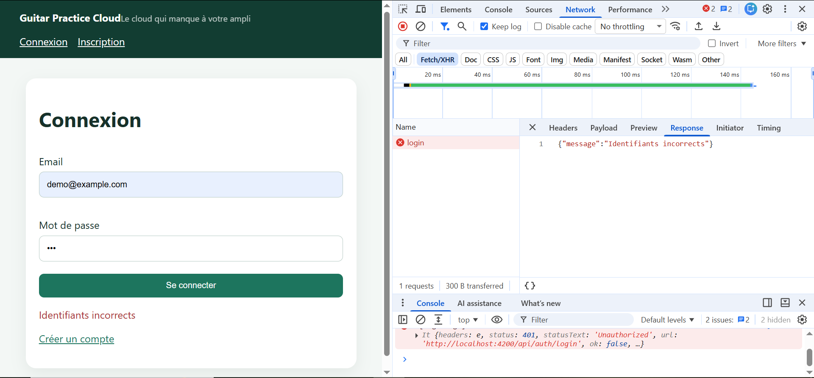
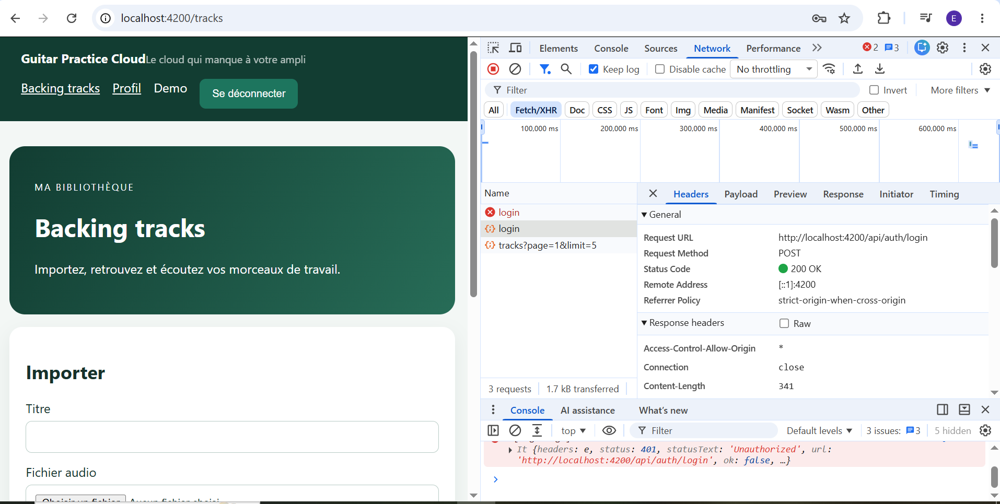
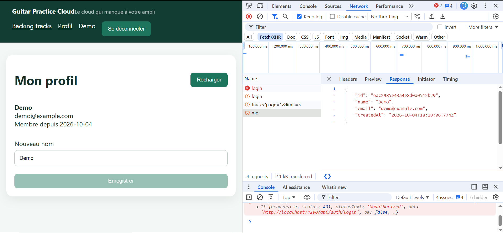
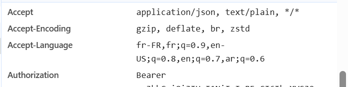

# TP1 — Réponses

Étudiante : Emili MERAHI (travail individuel)

## Mission 0 — Cartographie de l'application

| Élément | Fichier | Rôle |
|---|---|---|
| Composant racine | `src/app/components/app/app.ts` | `AppComponent` : en-tête, navigation, `<router-outlet />` |
| Démarrage | `src/main.ts` | `bootstrapApplication(AppComponent, …)` |
| Routes | `src/app/routes.ts` | `/login`, `/register` publiques ; `/profile`, `/tracks` protégées par `authGuard` |
| HttpClient | `src/main.ts` ligne 11 | `provideHttpClient(withInterceptors([authInterceptor]))` |
| Modèles | `src/app/shared/models/` | `User`, `AuthResponse`, `Track`, `Page<T>` |
| Services | `src/app/shared/services/` | `AuthService` (auth + profil), `TrackService` (pistes audio) |
| Pages | `src/app/components/*-page/` | login, register, profile, tracks |
| Ajout du JWT | `src/app/shared/interceptors/auth.interceptor.ts` | ajoute `Authorization: Bearer <token>` à chaque requête |
| Protection des pages | `src/app/shared/guards/auth.guard.ts` | sans token → redirection vers `/login` |

## Routes publiques et protégées (API_CONTRACT.md)

- **Publiques** (pas de JWT) : `GET /api/health`, `POST /api/auth/register`, `POST /api/auth/login`
- **Protégées** (JWT obligatoire) : `GET /api/users/me`, `PUT /api/users/me`, `GET /api/tracks`, `POST /api/tracks`, `GET /api/tracks/:id/audio`, `DELETE /api/tracks/:id`

## Schéma du flux « Se connecter »

```text
[Clic « Se connecter »]
        │
        ▼
LoginPageComponent.submit()          (login-page.ts)
        │  lit email + mot de passe du formulaire
        ▼
AuthService.login(email, password)   (auth.service.ts)
        │
        ▼
HttpClient.post('/api/auth/login', {email, password})
        │
        ▼
authInterceptor                      (pas encore de token → requête inchangée)
        │
        ▼
Proxy Angular  localhost:4200 → localhost:3000   (proxy.conf.json)
        │
        ▼
Express  POST /api/auth/login        (backend/src/app.js)
        │  User.findOne({email}) + bcrypt.compare(mot de passe)
        ▼
MongoDB Atlas  (base guitar-practice-cloud, collection users)
        │
        ▼
Réponse : 200 {token, user}   ou   401 {message: "Identifiants incorrects"}
        │
        ▼
AuthService : tap() → localStorage.setItem('gpc_token')
                     + Signal token + Signal currentUser
        │
        ▼
LoginPageComponent → router.navigateByUrl('/tracks')

Requêtes suivantes : authInterceptor ajoute  Authorization: Bearer <token>
```

## Mission 1 — Questions

### Routes du backend utilisées

`POST /api/auth/register`, `POST /api/auth/login`, `GET /api/users/me`, `PUT /api/users/me`, et `GET /api/tracks?page=1&limit=5` (appelée automatiquement après la connexion, car on est redirigé vers `/tracks`).

### Où s'effectue la « mise à jour du profil utilisateur » ?

**Côté front :**
1. `profile-page/profile-page.html` : formulaire `(ngSubmit)="save()"`, champ `formControlName="name"`.
2. `profile-page/profile-page.ts` : `save()` valide le formulaire puis appelle `auth.update(name)`.
3. `shared/services/auth.service.ts` : `update(name)` fait `http.put('/api/users/me', { name })` puis met à jour le Signal `currentUser`.
4. `shared/interceptors/auth.interceptor.ts` : ajoute `Authorization: Bearer <token>`.

**Côté back :**
1. `backend/src/app.js` : route `app.put("/api/users/me", auth, ...)`. Le middleware `auth` vérifie le JWT et place l'id de l'utilisateur dans `req.auth.sub`.
2. `User.findByIdAndUpdate(req.auth.sub, { $set: { name } }, { runValidators: true })`.
3. `backend/src/models/User.js` : le schéma impose `name` obligatoire, au moins 2 caractères.

### Où se trouvent les traces du backend ?

Dans le **terminal où le backend a été lancé** (`npm start` dans `backend/`). On y voit par exemple `[http] PUT /api/users/me -> 200`. Les traces du front sont dans la **console** des DevTools du navigateur, et les requêtes HTTP dans l'onglet **Network** (filtre Fetch/XHR).

### Gestion du 401

- 401 sur `/api/auth/login` = mauvais mot de passe → message « Identifiants incorrects » dans le formulaire.
- 401 sur une route protégée = token absent, invalide ou expiré (durée 2 h) → `authInterceptor` appelle `auth.logout()` : suppression du token, Signals remis à `null`, redirection vers `/login`.

## Différence entre Signal et localStorage

| | Signal (`token`, `currentUser`) | localStorage (`gpc_token`) |
|---|---|---|
| Où | en mémoire, dans l'application Angular | stockage du navigateur |
| Durée de vie | perdu au rechargement de la page (F5) | conservé après F5 et fermeture de l'onglet |
| Réactivité | **réactif** : l'affichage se met à jour tout seul quand il change | **non réactif** : Angular n'est pas prévenu d'un changement |
| Contenu | n'importe quelle valeur typée (`User \| null`) | uniquement du texte |
| Rôle ici | état affiché (nom dans l'en-tête, menu) | garder le token entre deux chargements |

On utilise les deux : à la connexion, le token est écrit dans le localStorage **et** dans le Signal. Au démarrage, le Signal `token` est initialisé depuis le localStorage, puis `AppComponent` recharge le profil (`GET /api/users/me`) pour remplir `currentUser`.

## Checkpoint Network

| Requête | Méthode | URL | Corps envoyé | Statut | Réponse | Authorization |
|---|---|---|---|---|---|---|
| Connexion refusée | POST | `/api/auth/login` | `{email, password}` (masqué) | 401 | `{"message":"Identifiants incorrects"}` | non |
| Connexion réussie | POST | `/api/auth/login` | `{email, password}` (masqué) | 200 | `{token (masqué), user}` | non |
| Lecture du profil | GET | `/api/users/me` | — | 200 | `{id, name, email, createdAt}` | oui (Bearer, masqué) |







